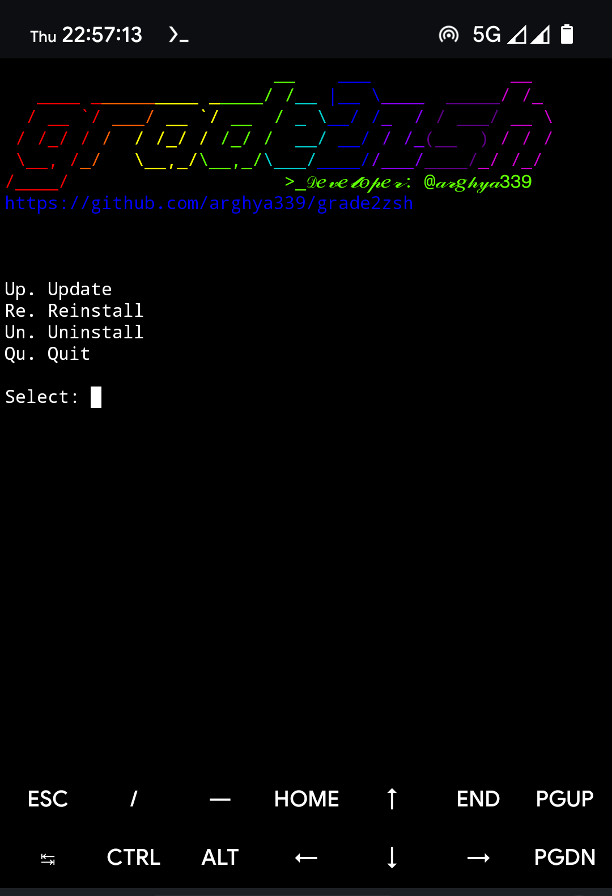

<h1 align="center">grade2zsh</h1>
<p align="center">
Customize your Termux by upgrade to zsh
<br>
<br>

<br>

## Purpose
- This script automates the process of Upgrade or Downgrade Termux to zsh.

## Prerequisites
- Android device with working internet connection and Termux installed.

## Usage
- Open [Termux](https://github.com/termux/termux-app/releases/) and type following command and press `Enter` key twice:
  ```
  termux-change-repo
  ```
- Update Termux pkg:
  ```sh
  pkg update && pkg upgrade -y
  ```

- Run the script with the following command:
  ```sh
  curl --progress-bar -o "$HOME/.grade2zsh.sh" "https://raw.githubusercontent.com/arghya339/grade2zsh/refs/heads/main/grade2zsh.sh" && bash $HOME/.grade2zsh.sh
  ```
- run
  ```
  grade2zsh
  ```

> [!NOTE]
> This script was tested on an Android device running Android 14 with AOSP based custom ROM with Termux v0.118.1 .

## Dependencies
["zsh"](https://github.com/termux/termux-packages/tree/master/packages) [[Apache 2.0]](https://github.com/termux/termux-packages/blob/master/LICENSE.md), ["oh-my-zsh"](https://github.com/ohmyzsh/ohmyzsh) [[MIT]](https://github.com/ohmyzsh/ohmyzsh/blob/master/LICENSE.txt), ["Git"](https://github.com/git/git) [[GPL 2.0]](https://github.com/git/git/blob/master/COPYING), ["zsh-autosuggestions"](https://github.com/zsh-users/zsh-autosuggestions) [[MIT]](https://github.com/zsh-users/zsh-autosuggestions/blob/master/LICENSE), ["zsh-syntax-highlighting"](https://github.com/zsh-users/zsh-syntax-highlighting) [[BSD 3]](https://github.com/zsh-users/zsh-syntax-highlighting/blob/master/COPYING.md)

## How it works (_[Demo on YouTube](https://youtu.be/G7eH0tFj_SM)_)

## Devoloper info
- Powered by `zsh`
- Developer: [@arghya339](https://github.com/arghya339)
